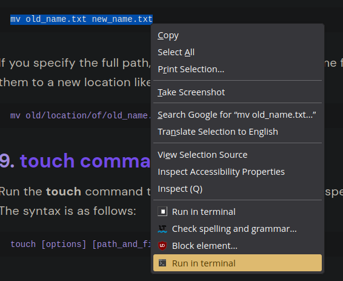
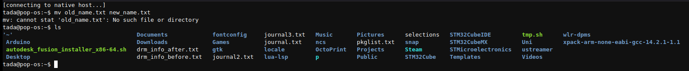
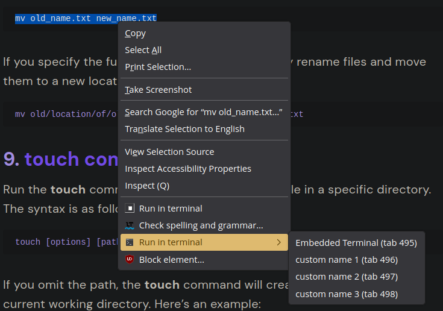
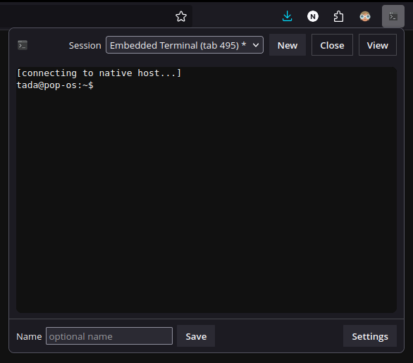
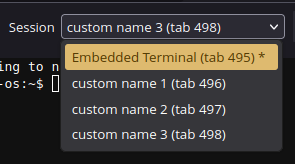

# Run in Terminal

Right-click code -> run it in a real shell inside a browser tab:

Opens a real terminal, streamed to your browser:

If you already have multiple sessions, simply select which one to use:

No need to search tabs! All your terminal sessions are right in the extension popup: 

Select the streamed session:

## What it is / what it isn’t

- **Is:** a browser extension that sends selected text to a live shell (PTY) via a tiny local **native host** (Python).
- **Is:** multi-session aware (name tabs, pick a specific target), with optional **danger substring** confirmation.
- **Isn’t:** a sandbox, VM, or remote executor. It runs **on your machine** and executes exactly what you tell it.
- **Isn’t:** a full terminal replacement; it’s a fast bridge from web -> shell.

## How it works

- **Context menu**
  - **Run in terminal** -> runs in the active terminal tab (focuses it).
  - **Run in specific terminal** -> appears when 2+ terminal tabs exist; pick a session.
- **Terminal tab** -> xterm.js front-end talking to a Python PTY host via Native Messaging.
- **Popup** -> mirrors any terminal tab (history + live), lets you switch sessions, create new, and set names.
- **Safety** -> optional confirm-on-danger (substring list is editable). Optional “ask before close” while a PTY runs.

## Install

### Requirements

- **Python 3** on your system.
- Linux/macOS: **curl** or **wget**.  
- Windows: **PowerShell 5+**.

### 0) Build the extension

- `npm run release:chrome` or `npm run release:firefox`
- Use only the output in `dist/` for the following step

### 1) Load the extension

- **Chrome/Chromium/Brave/Edge:** `chrome://extensions` → **Load unpacked** -> select the folder `dist/chrome/run-in-terminal`.
- **Firefox:** `about:debugging#/runtime/this-firefox` → **Load Temporary Add-on…** -> select `dist/firefox/run-in-terminal/manifest.json`.

### 2) Install the native host (per-browser, per-user)

1. Open the extension **Options** page.
2. Click **Generate installer** for your OS:
   - **Linux/macOS:** downloads `rit-install-<browser>-linux-mac.sh`
   - **Windows:** downloads `rit-install-<browser>-windows.ps1`
3. Run the script:
   - It downloads the Python host from GitHub into your user directory.
   - Registers the native-messaging JSON for **the browser you used** to generate it.
4. Restart the browser and click **Ping host** in Options -> you should see a **Pong**.

### 3) Use it

- Select text on any page -> right-click -> **Run selection in terminal**.  
- Use the popup to mirror a session, switch sessions, create a new terminal, or set a name.  
- Tweak safety in Options (danger substrings, confirm, close protection).

## Notes

As I'm not in possession of a windows machine, windows support is available but questionable. I wouldn't trust the installer script tbh.
> [!TIP]
> Consider uninstalling windows :)

